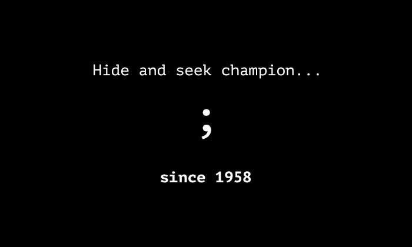

# Ahmed Abdelhafiez
<!-- banner -->

 Front-end developer. Proficient in building responsive, user-friendly interfaces and
translating designs into functional applications. Eager to contribute and grow within a
dynamic team.

### Your can reach me at: **<iknevo.dev@gmail.com>**

<!-- got u -->

 
 

<b>Skills and Tools</b>

 

&nbsp;
&nbsp;
&nbsp;
&nbsp;
&nbsp;
&nbsp;
&nbsp;
&nbsp;
&nbsp;
&nbsp;
&nbsp;
&nbsp;
&nbsp;
&nbsp;
&nbsp;
&nbsp;
&nbsp;
&nbsp;
&nbsp;
&nbsp;

##

 

<picture>
  <source media="(prefers-color-scheme: dark)" srcset="https://raw.githubusercontent.com/idknevo/idknevo/output/github-snake-dark.svg" />
  <source media="(prefers-color-scheme: light)" srcset="https://raw.githubusercontent.com/idknevo/idknevo/output/github-snake.svg" />
  
</picture>
 
 

